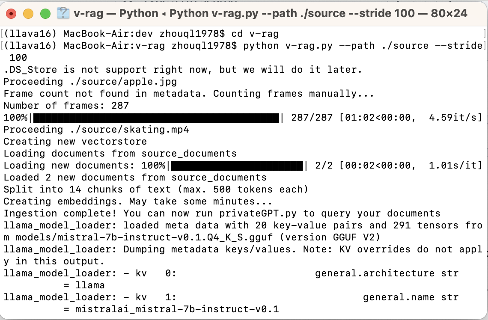
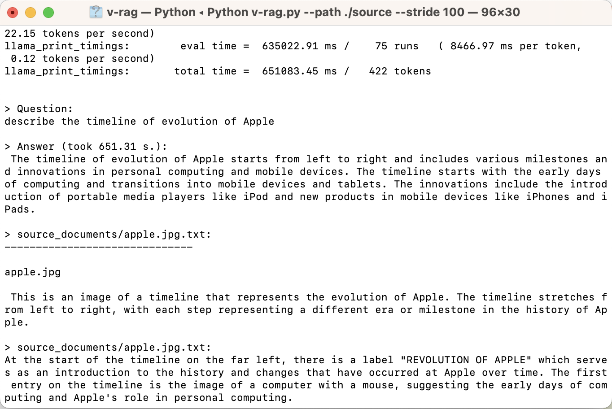

# <center> **Visual RAG** </center>

Build your own **Visual RAG** Application using less than 300 lines of code.

You can talk to your visual documents with LLM.





* **Features**
    - Ingest your videos and pictures  with Multimodal LLM
    - Q&A with LLM about your visual files
    - Run locally without compromising your privacy
    - Locating the relevant resource with quotation
    - Extremely simple with only one python file with no more than 240 lines of code
* **Process**
    - Parse videos or pictures in the folder into text with LLava, which run locally with ollama
    - Ingest the text into vectorDB
    - Query it with local LLM.
* **Setup**
    - **Create and activate virtual environment**
        
        ```bash
        python -m venv v-rag
        source v-rag/bin/activate
        ```
        
    - **Clone repo and install dependencies**
    
      ```bash
      git clone https://github.com/13331112522/v-rag.git
      cd v-rag
      python -m pip install -r requirements.txt
      cp example.env .env
      ```
    
    - **Get ready for models**
        - Put local LLM weights into folder _models_, supporting any GGUF format, and change the MODEL_PATH in .env for your model path. You can download the weights by visiting [Huggingface/theBloke](https://huggingface.co/TheBloke). We use [mistral-7b-instruct-v0.1.Q4_K_S.gguf](https://huggingface.co/TheBloke/Mistral-7B-Instruct-v0.2-GGUF) as our LLM for query.
        - We currently employed the HuggingfaceEmbedding, but you can change it to local embedding like GPT4ALLEmbedding by changing the EMBEDDINGS_MODEL_NAME in .env.
        - Run MLLM. We employ the latest llava 1.6 for image and video parsing.
        
        ```bash
        ollama run llava
        ```
    - **Environment variables setting**
      
        - Change the environment variables according to your needs in .env.
        - Replace with the actual path to your FFmpeg executable in _os.environ["IMAGEIO_FFMPEG_EXE"] = "/path/to/ffmpeg"_ to leverage the FFmpeg backend.
  
    - **Run**
        
        Put all the images and videos you want to talk with into the folder _source_. Run following command:
        
        ```bash
        python v-rag.py --path ./source --stride 25
        ```
        Path refers to the folder which contains all the images and videos you want to retrieve, and stride refers to the frame interval for video parse. For long video parse, you can change _stride_ to big number for higher process speed but less details.
      
        It will generate the folder _source_documents_ as the storage of parsed text and _faiss_index_ as the vectorDB. If the two folders already exist, it will start query directly.
* **To-do List**
    - [ ] WebUI
    - [ ] JSON support rather than txt
    - [ ] Video playback with the query result.
    - [ ] Evaluation on open Dataset
    - [ ] MultiModal RAG
    - [ ] Docker support
* **Acknowledgement**
    - llava 1.6
    - PrivateGPT
    - ollama
    - langchain
    - Llama.cpp
